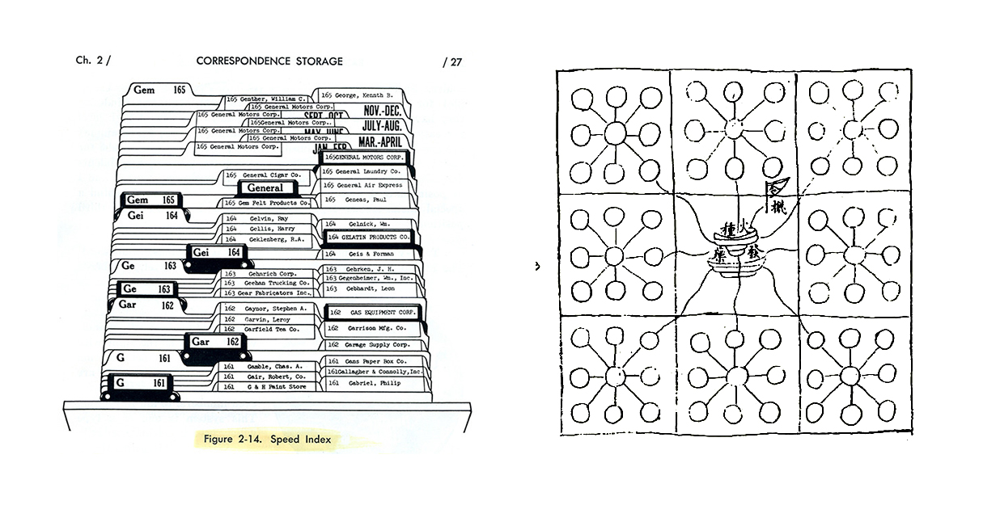

> 이 프로젝트의 내용은 [@melaniehoff](https://github.com/melaniehoff)의 [Peer-to-Peer-Folder-Poetry](https://github.com/melaniehoff/Peer-to-Peer-Folder-Poetry)를 기반으로 합니다. 한국에서 오프라인 세션을 진행하기 위해 원본 저장소의 내용을 번역 및 수정했습니다.

# Peer-to-Peer Folder Poetry

우리만을 위한 온라인 네트워크를 직접 만들어볼 수 있다면 어떨까요? 어떤 이야기를 담고싶나요? 우리가 Peer-to-Peer Folder Poetry(폴더 시) 실험 세션에서 함께 탐구해볼 주제입니다.

우리는 컴퓨터 폴더 구조를 이용해 시를 쓸 겁니다. 네! 서정시, 서사시같은 시요. 폴더와 파일에 리드미컬한 이름을 붙여 운율을 만들거나, 폴더를 타고 타고 들어가며 이어지는 스토리를 만들거나, 눈 앞에 펼쳐진 여러 개의 폴더 중에 독자가 스스로 선택해나가는 모험을 만들어보세요.

우리가 쓴 폴더 시는 Dat Peer-to-Peer(P2P) 네트워크를 통해 서로에게 전달될 거에요. 친구에게 받은 선물을 열어보는 마음으로 폴더 시를 열어보세요. 각자의 폴더 시를 연결해 새로운 이야기를 만들 수도 있습니다.

몇 가지 [폴더 시 예시](#폴더-시-예시)를 확인해보세요.

네트워크를 통해 전달된 폴더 시를 읽으며 서로의 마음을 나누는 동안, 우리는 각자의 컴퓨터와도 친해질 거예요. 이 실험 세션에서 우리는 커맨드라인 인터페이스(CLI)와 Bash를 사용합니다. GUI를 사용할 때보다 컴퓨터에 한 발 더 가까이 다가가 말을 건네는 듯한 느낌을 경험해보세요.

이 실험 세션은 참가자가 코딩 경험이 없다는 것을 전제로 합니다.

## 오프라인 세션

> [@melaniehoff](https://github.com/melaniehoff)의 오프라인 세션은 [Peer-to-Peer-Folder-Poetry 원본 저장소](https://github.com/melaniehoff/Peer-to-Peer-Folder-Poetry#workshops)에 업데이트되고 있습니다.

* **[ulpc](sessions/ulpc.md) autumn 2019**
  * 2019/11/22 20:00
  * 2019/11/23 18:30

## 준비물

- macOS(OS X), 리눅스 또는 [윈도우 10](https://gist.github.com/solon/4e254be6e0d2e73ef8624470fc9ca852#file-folder-poetry-setup-md)이 탑재된 컴퓨터
- 소프트웨어 패키지 다운로드를 위한 인터넷 연결
- 소프트웨어 패키지 설치를 위한 관리자 권한

## 세션 목표

- 컴퓨터 폴더 구조를 표현 수단으로 감정을 전달하는 시를 써본다.
- Dat P2P 네트워크를 통해 서로의 시를 전달하는 작은 커뮤니티를 만든다.
- CLI와 Bash를 사용해보며 컴퓨터와 친밀감을 형성한다.

## 폴더 시 예시

* 📒[Download: Folder Poetry - SFPC Yamaguchi Japan Zine](https://melanie-hoff.com/folder-poetry/sfpc-ycam/zine-pdfs-ycam-folder-poetry.zip)
* 📒[Download: Folder Poetry - SFPC Detroit Zine](https://melanie-hoff.com/folder-poetry/sfpc-detroit/detroit-zine-reader.pdf.zip)
* [folderpoetry.club](http://folderpoetry.club)

## 이런 말들을 사용해요

| 용어 | 해설 |
| - | - |
| 폴더 시 | 컴퓨터 폴더 구조를 이용해 쓰는 시. 폴더와 파일에 리드미컬한 이름을 붙여 운율을 만들거나, 폴더를 타고 타고 들어가며 이어지는 스토리를 만들거나, 눈 앞에 펼쳐진 여러 개의 폴더 중에 독자가 스스로 선택해나가는 모험을 만들어보세요. |
| CLI | Command line interface. 터미널을 통해 사용자와 컴퓨터가 상호 작용하는 방식. 작업 명령은 사용자가 컴퓨터 키보드 등을 통해 문자열의 형태로 입력하며, 컴퓨터로부터의 출력 역시 문자열의 형태로 주어진다. ([출처](https://ko.wikipedia.org/wiki/%EB%AA%85%EB%A0%B9_%EC%A4%84_%EC%9D%B8%ED%84%B0%ED%8E%98%EC%9D%B4%EC%8A%A4)) |
| 셸 | 키보드로 명령어를 입력하고 운영체제가 구동하도록 하는 프로그램 ([출처](http://www.looah.com/article/view/1451)) |
| Bash | Unix의 기본 셸 프로그램인 sh의 개량형 ([출처](http://www.looah.com/article/view/1451)) |
| 터미널 | 윈도우상에서 쉘에 명령어를 보내고 결과를 받아볼수 있는 프로그램 ([출처](http://www.looah.com/article/view/1451)) |
| Peer-to-Peer(P2P) 네트워크 | 중앙 서버 없이 각각의 컴퓨터가 서버로 기능하는 분산 네트워크 |
| Dat | 우리가 이 실험 세션에서 사용할 P2P 네트워크 유틸리티 ([공식 홈페이지](https://dat.foundation/)) |
| 폴더 | (또는 디렉토리) 컴퓨터에서 파일을 알아보기 쉽게 저장하는 곳. 폴더는 다른 폴더와 파일을 포함할 수 있다. ([출처](https://terms.naver.com/entry.nhn?docId=1209362&cid=40942&categoryId=32840)) |
| 파일 | 컴퓨터에서 데이터의 모임으로 보조 기억장치에 저장된 것. ([출처](https://terms.naver.com/entry.nhn?docId=1209361&cid=40942&categoryId=32840)) |
| 파일 경로 | 시스템에서 특정 파일의 위치를 나타내는 문자열 예) `/Users/orange/work/Peer-to-Peer-Folder-Poetry` |

## 감사의 말

> [@melaniehoff](https://github.com/melaniehoff)의 감사의 말은 [Peer-to-Peer-Folder-Poetry 원본 저장소](https://github.com/melaniehoff/Peer-to-Peer-Folder-Poetry#acknowledgments--thank-you)에 업데이트되고 있습니다.
